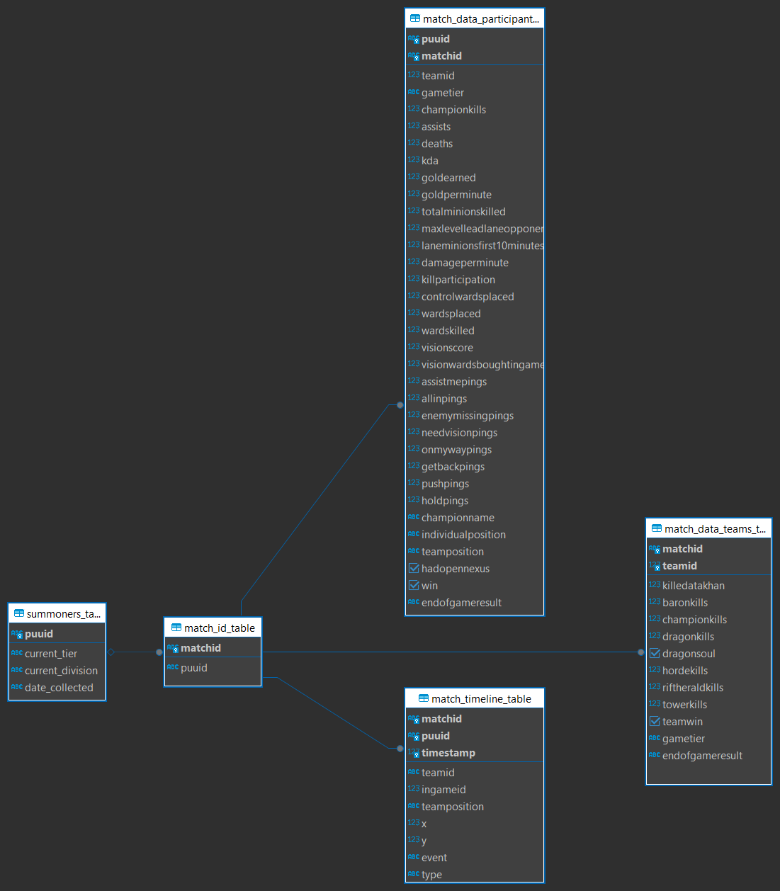

# 🧩 League of Legends Data Pipeline

- **Status**: In Development (Almost Completed)
- **Purpose**: Automated, configurable data pipeline for fetching, filtering, and storing _League of Legends_ match data using Riot's official API.
- **Additional Advanced Features to be Added**:
  - A class that will include functions to fetch data from the tables based on the desired parameters
  - Option to adjust the database structure more easily (including columns, foreign|primary key constraints, etc.)

---

## 🔍 Overview

This repository contains a modular, rate-limited, and well-logged data pipeline built around the [Riot Games API](https://developer.riotgames.com/). It automates the process of:

- Retrieving ranked match data across tiers and roles
- Filtering relevant events and timelines
- Storing structured results in a local SQLite database
- Preparing clean datasets for statistical analysis and machine learning

---

## 🏗️ Folder Structure

<pre>

League-of-Legends-data-pipeline/
├── data/
├── log_config/
│   ├── log_config.json
├── logs/
├── notebooks/
├── src/
│   ├── __pycache__/
│   ├── data_collection/
│   │   ├── __ini__.py
│   │   ├── riot_api.py
│   ├── pipeline/
│   │   ├── __init__py
│   │   ├── pipeline_workflow.py
│   ├── processing/
│   │   ├── __init__.py
│   │   ├── response_filters.py
│   ├── riot_key_folder/
│   │   ├── __init__.py
│   │   ├── config_template.json
│   │   ├── riot_api_key.py
│   ├── RiotAPI_Processing_Functions.egg-info/
│   ├── __init__.py
├── .gitignore
├── photos/
│   ├── API_Call_Workflow.png
├── documentation.txt
├── pipeline_configuration
├── main.py
├── README.md
├── setup.py
</pre>

---

## 🗃️ Database Schema

- PHOTO TO BE UPLOADED
  

# 🔁 API Call Workflow

## Overview

This workflow describes fetching and storing League of Legends match data through Riot Games' API.

## Workflow Steps

### 1. Input Queue, Tier, Division

- **Input**: Competitive tier (e.g., Challenger, Iron), queue (e.g., ranked, normal), and division (e.g., I, II)
- **API Call**: `/lol/league/v4/entries/{queue}/{tier}/{division}`
- **Action**:
  - Retrieve summoner entries for each tier and division (ranked)
  - Store data in SQL database

### 2. Get Match IDs from puuIDs

- **Fetch**: puuID from the database
- **API Call**: `/lol/match/v5/matches/by-puuid/{puuid}/ids`
- **Action**:
  - Get the list of recent match IDs for each player
  - Store data in an SQL database

### 3. Get Match Data

- **Fetch**: matchID from the database
- **API Call**: `/lol/match/v5/matches/{matchId}`
- **Extract**:
  - Participant-level data
  - Team-level data

### 4. Get Match Timeline

- **Fetch**: matchID from the database
- **API Call**: `/lol/match/v5/matches/{matchId}/timeline`
- **Extract**:
  - Events data
  - Frame-by-frame gameplay data

## ⚙️ Features

### 🔗 Riot API Interface (`riot_api.py`)

- Interacts with Riot’s Match-V5, Summoner-V4, and Spectator-V4 endpoints
- Fetches player PUUIDs, match histories, and timelines
- Implements robust error handling and rate limit compliance

### 🧠 Pipeline Controller (`pipeline_workflow.py`)

- End-to-end orchestration of:
  - Player and match data retrieval
  - Timeline extraction
  - Filter application and database storage
- Enables batch collection and control over sample size and rank tier

### 🧼 Filtering Module (IN PROGRESS)

- TBD

### 🧱 Database Integration (`riot_data_database.db`)

- Lightweight SQLite database setup
- Stores structured data across:
  - Match metadata
  - Participant performance
  - Event sequences and timelines

### 🪵 Logging System (`logs/riot_data.log`)

- Tracks request success/failure and error messages
- Useful for debugging long pipeline runs
- Controlled via `configs/log_config.json`

---

## 🧪 How to Run

### Installation

To install the RiotAPI Processing Functions locally, follow these steps:

Clone the repository:

<pre>
  git clone https://github.com/PadTo/League-of-Legends-data-pipeline.git
  cd League-of-Legends-data-pipeline
</pre>

Run the following command to install the package locally:

<pre>
  pip install .
</pre>

Make sure you're in the root directory of the project (where setup.py is located) before running the install command.

### ⚙️ Configure the Pipeline

Edit the pipeline_configuration.json file located in the project root. This file contains all runtime settings required by the pipeline:

EXAMPLE:

<pre>
{
  "database_save_location": "YOUR/DESIRED/DATA/PATH",
  "logging_configuration_filepath": "YOUR/DESIRED/LOG_CONFIG_PATH/log_config.json",
  "region": "https://eun1.api.riotgames.com",
  "rate_time_limit": [100, 120],
  "page_limit": 5,
  "stages_to_process": [1, 1, 1, 1],
  "eventTypesToConsider": ["CHAMPION_KILL", "BUILDING_KILL", "ELITE_MONSTER_KILL"]
}
</pre>

⚠️ Important Notes:

- `region` must be set to only a European region. Other regions are currently unsupported and will break the pipeline.
- `rate_time_limit` must be a tuple inside a list or tuple, e.g., [100, 120]. This defines 100 calls per 120 seconds.
- `page_limit` controls how many pages of match data to request per tier and division in stage 1. Set to -1 to disable the limit.
- `stages_to_process` enables/disables pipeline stages with 1s and 0s (e.g., [1, 1, 0, 0] to run only the first two).
  - stage 2 depends on stage 1
  - stage 3 and 4 depend on stage 2
  - if stage 1 has not been run, stage 2 cannot occur
  - if stage 2 has not been run, stage 3 and stage 4 cannot occur

### Run the Main Script

python main.py

When you run the file you will be prompted to input your Riot API key. You can choose to replace it or skip.

<pre>
  Do you want to replace the API key (Y for YES | N for NO)?
  If you type Y, you'll be prompted to enter your Riot API key:
</pre>

Once the key is entered, the pipeline will start and begin processing data.

NOTE:

- The collection process takes a long time (Hours) due to rate limiting (rate limits can be adjusted based on your needs and account constraints related to rates)
- The data WILL NOT be uploaded due to the database having millions of entries
