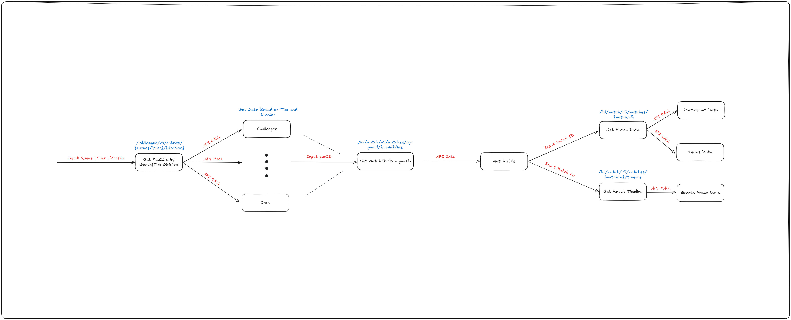

# 🧩 League of Legends Data Pipeline

> **Status**: In Development  
> **Purpose**: Automated, configurable data pipeline for fetching, filtering, and storing *League of Legends* match data using Riot's official API.

---

## 🔍 Overview

This repository contains a modular, rate-limited, and well-logged data pipeline built around the [Riot Games API](https://developer.riotgames.com/). It automates the process of:

- Retrieving ranked match data across tiers and roles
- Filtering relevant events and timelines
- Storing structured results in a local SQLite database
- Preparing clean datasets for statistical analysis and machine learning

---

## 🏗️ Folder Structure

<pre>

LoL_Analysis_Project/
├── data/
│   ├── riot_data_database.db
├── log_config/
│   ├── log_config.json
├── logs/
├── notebooks/
├── src/
│   ├── __pycache__/
│   ├── data_collection/
│   │   ├── __ini__.py
│   │   ├── riot_api.py
│   ├── pipeline/
│   │   ├── __init__py
│   │   ├── pipeline_workflow.py
│   ├── processing/
│   │   ├── __init__.py
│   │   ├── response_filters.py
│   ├── riot_key_folder/
│   │   ├── __init__.py
│   │   ├── config_template.json
│   │   ├── riot_api_key.py
│   ├── RiotAPI_Processing_Functions.egg-info/
│   ├── __init__.py
├── .gitignore
├── photos/
│   ├── API Call Workflow.png
├── documentation.txt
├── main.py
├── README.md
├── setup.py
</pre>
---

# 🔁 API Call Workflow

## Overview
This workflow describes fetching and storing League of Legends match data through Riot Games' API.



## Workflow Steps

### 1. Input Queue, Tier, Division
- **Input**: Competitive tier (e.g., Challenger, Iron), queue (e.g., ranked, normal), and division (e.g., I, II)
- **API Call**: `/lol/league/v4/entries/{queue}/{tier}/{division}`
- **Action**: 
  - Retrieve summoner entries for each tier and division (ranked)
  - Store data in SQL database

### 2. Get Match IDs from puuIDs
- **Fetch**: puuID from the database
- **API Call**: `/lol/match/v5/matches/by-puuid/{puuid}/ids`
- **Action**: 
  - Get the list of recent match IDs for each player
  - Store data in SQL database

### 3. Get Match Data
- **Fetch**: matchID from the database
- **API Call**: `/lol/match/v5/matches/{matchId}`
- **Extract**: 
  - Participant-level data
  - Team-level data

### 4. Get Match Timeline
- **Fetch**: matchID from the database
- **API Call**: `/lol/match/v5/matches/{matchId}/timeline`
- **Extract**: 
  - Events data
  - Frame-by-frame gameplay data

# 🗃️ Database Schema

## Overview
The database consists of 5 interrelated tables storing League of Legends data:

```mermaid
erDiagram
    Summoners_Table ||--o{ Match_ID_Table : has
    Match_ID_Table ||--o{ Match_Data_Teams_Table : contains
    Match_ID_Table ||--o{ Match_Data_Participants_Table : contains
    Match_ID_Table ||--o{ Match_Timeline_Table : contains

    Summoners_Table {
        TEXT puuid PK "Unique player identifier"
        TEXT current_tier "Current ranked tier"
        TEXT current_division "Current division"
        TEXT date_collected "Data collection timestamp"
    }

    Match_ID_Table {
        TEXT matchId PK "Unique match identifier"
        TEXT puuid FK "Reference to Summoners_Table"
    }

    Match_Data_Teams_Table {
        TEXT matchId FK "Reference to Match_ID_Table"
        INTEGER teamId "Team identifier (100/200)"
        TEXT gameTier "Consensus match tier"
        BOOLEAN teamWin "Match outcome"
        INTEGER baronKills
        INTEGER dragonKills
        INTEGER towerKills
        PRIMARY KEY (matchId, teamId)
    }

    Match_Data_Participants_Table {
        TEXT puuId "Reference to Summoners_Table"
        TEXT matchId FK "Reference to Match_ID_Table"
        INTEGER teamId "Team identifier"
        TEXT gameTier "Consensus match tier"
        INTEGER championKills
        INTEGER deaths
        FLOAT KDA
        PRIMARY KEY (puuId, matchId)
    }

    Match_Timeline_Table {
        TEXT matchId FK "Reference to Match_ID_Table"
        TEXT puuId "Event participant"
        INTEGER timestamp "Event time (ms)"
        TEXT event "Event type"
        TEXT type "Sub-event classification"
        INTEGER x "Map coordinate X"
        INTEGER y "Map coordinate Y"
        PRIMARY KEY (matchId, puuId, timestamp)
    }

## ⚙️ Features

### 🔗 Riot API Interface (`riot_api.py`)
- Interacts with Riot’s Match-V5, Summoner-V4, and Spectator-V4 endpoints
- Fetches player PUUIDs, match histories, and timelines
- Implements robust error handling and rate limit compliance

### 🧠 Pipeline Controller (`pipeline_workflow.py`)
- End-to-end orchestration of:
  - Player and match data retrieval
  - Timeline extraction
  - Filter application and database storage
- Enables batch collection and control over sample size and rank tier

### 🧼 JSON Filtering Module (IN PROGRESS)
- TBD

### 🧱 Database Integration (`riot_data_database.db`)
- Lightweight SQLite database setup
- Stores structured data across:
  - Match metadata
  - Participant performance
  - Event sequences and timelines

### 🪵 Logging System (`logs/riot_data.log`)
- Tracks request success/failure and error messages
- Useful for debugging long pipeline runs
- Controlled via `configs/logging_config.yaml`

---

## 🧪 How to Run

```bash

